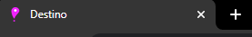
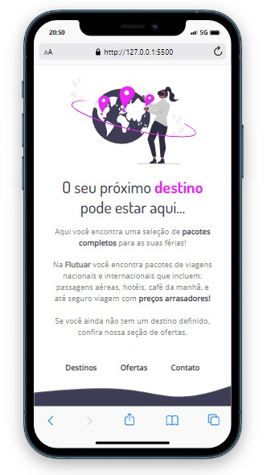
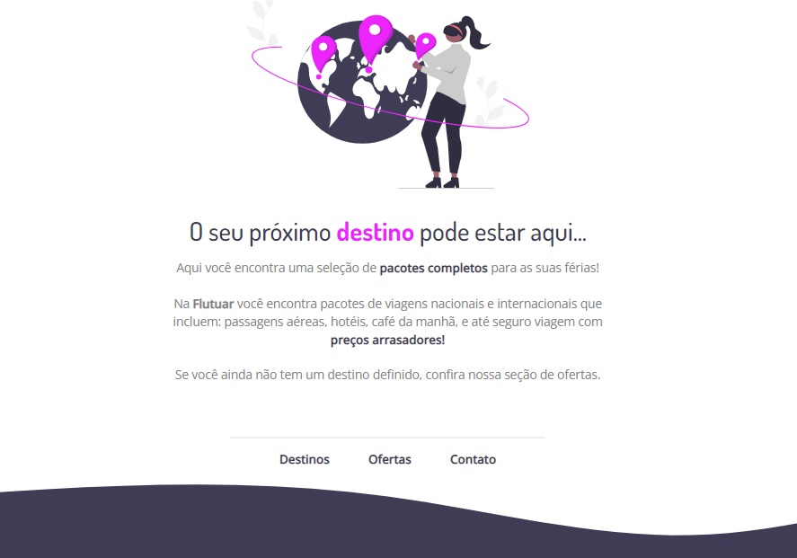

<h1 align="center">Recriando layout</h1>

 💻 Sobre o desafio

Nesse desafio, recriei uma aplicação, a partir de um layout pronto no Figma, para fortalecer alguns conceitos aprendidos, entre eles:

- Estruturando um projeto HTML;
- Uso de tags HTML mais comuns;
- Conceitos iniciais de CSS;
- Posicionamento e alinhamento de elementos na tela;
- Aplicando fontes customizadas;
- Espaçamentos.

  <a href="#-tecnologias">Tecnologias</a>&nbsp;&nbsp;&nbsp;|&nbsp;&nbsp;&nbsp;
  <a href="#-projeto">Projeto</a>&nbsp;&nbsp;&nbsp;|&nbsp;&nbsp;&nbsp;
  <a href="#-layout">Layout</a>&nbsp;&nbsp;&nbsp;|&nbsp;&nbsp;&nbsp;

 
OBS: desafio a parte, adicionar o ícone na parte superior, aonde fica o nome da pagina.  
(chamei a Pagina de "Destino")

 

  

 

 
Abaixo Pré visualização, da tela que eu criei:
 

  

  

 

## 🚀 Tecnologias

Esse projeto foi desenvolvido com as seguintes tecnologias:
- Figma
- HTML e CSS
- Git e Github
- VS Code

## 💻 Projeto

Pagina simples de uma empresa de viagens.

## 🔖 Layout

Você pode visualizar o layout do projeto através [DESSE LINK](https://www.figma.com/file/TkR3PPYRMpfUpmK0QOgLcp/Projeto01-Extra-(Copy)?node-id=1%3A2&t=zgnDjlT209cF5Fuz-0). É necessário ter conta no [Figma](https://figma.com) para acessá-lo.
